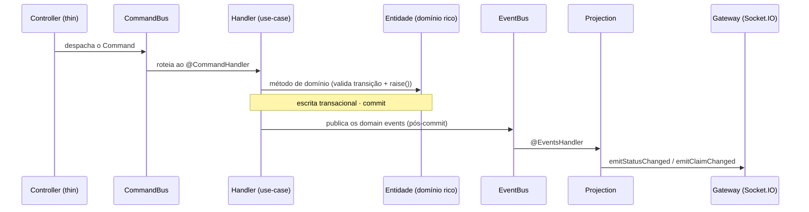

<div align="center">

# Back-end — `@capo/api`

O motor da API do CAPO — lógica de domínio, máquinas de estado, controle de concorrência e tempo real para os três estágios de chão de fábrica.

[](https://www.typescriptlang.org/)
[](https://nestjs.com/)
[](https://mikro-orm.io/)
[](https://socket.io/)
[](https://jestjs.io/)

</div>

## Visão geral

`@capo/api` é uma API REST + WebSocket construída com NestJS 11, seguindo o padrão **CQRS + domínio rico**. As regras de negócio (máquinas de estado, invariantes de _claim_) vivem nas próprias **entidades de domínio**; cada operação é um _use-case_ isolado, despachado sobre um `CommandBus` ou `QueryBus`. O progresso de uma ordem e o _gating_ entre estágios são **calculados na consulta**, a partir do estado das peças — nunca armazenados, o que elimina risco de dessincronização.

Os _domain events_ são publicados **pós-commit** num `EventBus` e projetados nos sockets de cada estágio, sem que a lógica de negócio precise saber o que é um WebSocket.

## Stack

| Camada           | Tecnologias                         |
| ---------------- | ----------------------------------- |
| **Framework**    | NestJS 11 (CQRS)                    |
| **ORM**          | MikroORM 7 (MariaDB)                |
| **Tempo real**   | Socket.IO                           |
| **Autenticação** | Passport + JWT (cookie `httpOnly`)  |
| **Validação**    | class-validator + class-transformer |
| **Documentação** | Swagger (OpenAPI)                   |
| **Testes**       | Jest, Testcontainers, Supertest     |

## Arquitetura

CQRS com dois _buses_ (`CommandBus` / `QueryBus`), sobre 12 módulos em `src/modules/`, por papel:

| Papel                     | Módulos                                  |
| ------------------------- | ---------------------------------------- |
| **Listas** (claim + WS)   | `cut-list`, `assembly-list`, `weld-list` |
| **Itens** (status events) | `pipe-length`, `joint`, `weld`           |
| **Lookup** (read-only)    | `filler-material`, `wps`                 |
| **Infra**                 | `auth`, `user`, `user-role`, `document`  |

A infraestrutura transversal fica em `config/` (ORM, throttler, Swagger), `common/` (guards, policies, utils), `database/entities/` (entidades compartilhadas) e `shared/` (DTOs e tipos). Cada feature em `src/modules/<name>/` tem:

- **`*.controller.ts`** — fino: só verifica o papel do operador, despacha a mensagem no bus, retorna a entidade.
- **`entities/*.entity.ts`** — **domínio rico**: máquinas de estado (`startCutting`, `complete`), métodos de _claim_ (`claimBy`, `release`, `reassignTo`); herdam de `AggregateRoot` e usam `raise()` para emitir _domain events_.
- **`application/commands.ts`** + **`application/handlers/*.handler.ts`** — um caso de uso por arquivo (`@CommandHandler`); a escrita é transacional, depois o handler publica os eventos da entidade **pós-commit** via `EventBus`.
- **`application/queries.ts`** + **`application/handlers/*.handler.ts`** — cada consulta isolada (`@QueryHandler`).
- **`events/*.event.ts`** + **`*.projection.ts`** — um _domain event_ e o `@EventsHandler` que o projeta no socket do estágio.
- **`*.gateway.ts`** _(módulos de lista)_ — `@WebSocketGateway` com middleware de autenticação JWT; métodos `emit*` que as projeções chamam.
- **`*.repository.ts`** — `EntityRepository` personalizado com `FULL_POPULATE` (constantes de populate profundo) e queries raw-SQL para **contagem e gating** (filtrar e agregar no DB, nunca em JS).
- **`*.module.ts`** — `imports`/`controllers`/`providers` locais; handlers e projeções listados individualmente.

Controller é _thin_; handler é o caso de uso. A entidade decide se uma transição é válida — nunca o handler.



## Entidades de domínio

Domínio rico via MikroORM — as entidades carregam **comportamento** (máquinas de estado, _claim_), não só dados. As compartilhadas ficam em `@database/entities/`; as de estágio, em cada módulo. O **schema** (campos, FKs, ENUMs, herança joined-table, o trail `<item>_status_event`) vive no doc da DB; aqui fica só o papel de cada uma no domínio.

| Entidade                                         | Papel no domínio                                                    |
| ------------------------------------------------ | ------------------------------------------------------------------- |
| `Project` → `Isometric` → `Spool` → `Joint`      | Hierarquia da tubulação; o isométrico guarda o PDF do desenho       |
| `Part` = `PipeLength` \| `Fitting` → `Port`      | Peça (herança joined-table); uma `Joint` une `part1` + `part2`      |
| `Weld`                                           | Solda de uma junta; referencia `FillerMaterial` + `Wps`             |
| `CutList` / `AssemblyList` / `WeldList`          | Ordens de trabalho (1:1 com isométrico/spool); não armazenam status |
| `Diameter` / `Material` / `FittingType` / `Role` | Lookups e papéis de usuário                                         |

Cada item tem um `status` (ENUM) como estado atual **mais** um trail append-only `<item>_status_event` (auditoria: quem, o quê, quando) — as transições estão em **Itens — Transições de status**. Cada lista carrega `claimedById` + `claimedAt`, o lock exclusivo (ver **Controle de concorrência**).

## Autenticação

JWT no cookie `token` (`httpOnly`). Nenhum _guard_ protege `/auth/login` — o _throttler_ é mais rigoroso neste endpoint.

| Endpoint            | Método         | Guardas      | Handler                                           |
| ------------------- | -------------- | ------------ | ------------------------------------------------- |
| `POST /auth/login`  | `LoginCommand` | Nenhum       | Verifica senha, assina JWT, define cookie `token` |
| `POST /auth/logout` | —              | JwtAuthGuard | Limpa cookie `token`                              |
| `GET /auth/me`      | `GetMeQuery`   | JwtAuthGuard | Retorna perfil + papéis do usuário                |

O _strategy_ `JwtCookieStrategy` extrai `req.cookies["token"]`, valida com `@nestjs/jwt` e injeta o usuário via `@User()`. `GetMeQuery` retorna o usuário com os papéis resolvidos.

## Listas — _Claim_

Cada módulo de lista expõe um sub-recurso de _claim_ sobre `/:id/claim`:

| Endpoint                       | Método                        | Papel                               |
| ------------------------------ | ----------------------------- | ----------------------------------- |
| `GET /<x>-lists`               | `Get<Stage>ListsQuery`        | papel do estágio + `administrator`  |
| `GET /<x>-lists/:id`           | `Get<Stage>ListQuery`         | papel do estágio + `administrator`  |
| `GET /<x>-lists/pending-count` | `GetPending<Stage>CountQuery` | papel do estágio + `administrator`  |
| `POST /<x>-lists/:id/claim`    | `Claim<Stage>ListCommand`     | papel do estágio + `administrator`  |
| `DELETE /<x>-lists/:id/claim`  | `Release<Stage>ListCommand`   | **dono do claim** + `administrator` |
| `PUT /<x>-lists/:id/claim`     | `Reassign<Stage>ListCommand`  | **apenas `administrator`**          |

O progresso de uma lista é derivado das contagens de status dos seus itens (raw-SQL no repositório). A disponibilidade (_gating_) é determinada no repositório:

- **Cut** → todas as listas aparecem.
- **Assembly** → só listas cujo isométrico tem todos os `pipe_length` como `DONE` (raw-SQL `getCutCompleteIsometricIds`).
- **Weld** → só listas cujo spool tem todos os `joint` como `DONE` (raw-SQL `getAssemblyCompleteSpoolIds`).

O _claim_ usa `SELECT … FOR UPDATE` (_pessimistic write_) no repositório — dois operadores competindo pela mesma ordem nunca corrompem o estado.

## Itens — Transições de status

Cada módulo de item expõe endpoints para avançar o status do item individual:

| Endpoint                          | Método                           | Papel                               |
| --------------------------------- | -------------------------------- | ----------------------------------- |
| `GET /<item>s/:id`                | `Get<Item>Query`                 | papel do estágio + `administrator`  |
| `GET /<item>s/:id/status-events`  | `Get<Item>StatusEventsQuery`     | papel do estágio + `administrator`  |
| `POST /<item>s/:id/status-events` | `Create<Item>StatusEventCommand` | **dono do claim** + `administrator` |

O handler de criação carrega o item, localiza a lista associada via repositório da lista, verifica `ClaimControlPolicy.assertControls(list, userId)` e chama o método de domínio (`startCutting`, `complete`, etc.) — tudo dentro de uma transação.

### Máquina de estados

| Entidade           | Transições                   | Dados obrigatórios            |
| ------------------ | ---------------------------- | ----------------------------- |
| `PipeLengthEntity` | `TO_DO → IN_PROGRESS → DONE` | `heatNumber` no `IN_PROGRESS` |
| `JointEntity`      | `TO_DO → DONE`               | —                             |
| `WeldEntity`       | `TO_DO → DONE`               | `fillerMaterial` + `wps`      |

O `JointEntity` tem uma restrição `@Check` no DB: `part1_id != part2_id` — uma junta não pode conectar uma peça a si mesma.

Os métodos de domínio (ex. `PipeLength.startCutting`) validam a transição, criam a entidade de status event, adicionam à coleção e chamam `raise()` para empilhar o _domain event_.

## Lookup — dados referenciais

Dois módulos **read-only** para dados de referência:

| Módulo            | Endpoint                | Uso                           |
| ----------------- | ----------------------- | ----------------------------- |
| `filler-material` | `GET /filler-materials` | Listar/selecionar na soldagem |
| `wps`             | `GET /wps`              | Listar/WPS com documento PDF  |

Ambos expõem `GET /:id` para consulta individual. Sem mutações.

## Documentos estáticos

`GET /documents/:section/:filename` — serve ficheiros (PDF, PNG, JPG) de pastas de storage.

**Proteção contra _path traversal_:** _allowlist_ de seções (`isometric`, `wps`), validação `resolve()` + `startsWith()` para garantir que o caminho não escapa da pasta, e _MIME type detection_ (só `application/pdf`, `image/png`, `image/jpeg` são aceitos).

## Controle de concorrência (_Claim_)

`ClaimControlPolicy.assertControls(order, userId)` — permitido se `order.claimedBy.id === userId` ou o usuário tem o papel `administrator`; caso contrário, lança `ForbiddenException`.

A política depende de `UserRoleService.hasRole()` para verificar se o usuário é administrador. É verificada em cada handler de status event, antes de avançar o item.

Os três módulos de lista (`CutList`, `AssemblyList`, `WeldList`) **compartilham a mesma lógica de claim** — testada por um teste parametrizado único (`list-claim-lock.spec.ts`) sobre as três entidades.

## Tempo real (WebSocket)

Cada módulo de lista é um `@WebSocketGateway` com namespace dedicado (`/cut-list`, `/assembly-list`, `/weld-list`). O _handshake_ é autenticado via JWT: o middleware `createWsAuthMiddleware` extrai o cookie `token` da handshake, valida o JWT e anexa `socket.data.user`.

### Projeções

| Evento                         | Projeção                            | Gateway               | Ação                            |
| ------------------------------ | ----------------------------------- | --------------------- | ------------------------------- |
| `CutListClaimChangedEvent`     | `CutListClaimChangedProjection`     | `CutListGateway`      | `emitClaimChanged(id)`          |
| `PipeLengthStatusChangedEvent` | `CutListPipeLengthStatusProjection` | `CutListGateway`      | `emitStatusChanged(pipeLength)` |
| `JointStatusChangedEvent`      | `AssemblyListJointStatusProjection` | `AssemblyListGateway` | `emitStatusChanged(joint)`      |
| `WeldStatusChangedEvent`       | `WeldListWeldStatusProjection`      | `WeldListGateway`     | `emitStatusChanged(weld)`       |

### Sinalização entre estágios

Cada módulo de lista **escuta** o evento do estágio anterior e reemite um sinal de _invalidation_:

| Gateway               | Escuta                         | Reemite          |
| --------------------- | ------------------------------ | ---------------- |
| `AssemblyListGateway` | `PipeLengthStatusChangedEvent` | `emitUpstream()` |
| `WeldListGateway`     | `JointStatusChangedEvent`      | `emitUpstream()` |

O cliente web invalida a query do TanStack Query a cada evento, fazendo o servidor recomputar o estado derivado no próximo _refetch_. Um único `EventBus` — sem `EventEmitter2`.

## Segurança

- **`helmet()`** — headers de segurança HTTP.
- **`@nestjs/throttler`** — rate-limit global (100 req/60s por default) + rate-limit mais rigoroso para login (5 req/60s por default).
- **`ValidationPipe` global** — _whitelist_ + _forbidNonWhitelisted_ + _transform_ (converte DTOs).
- **`CORS`** — configurável via `CORS_ORIGIN`.
- **`AllExceptionsFilter` global** — padroniza respostas de erro; log de erros não-HTTP.
- **`RolesGuard`** — aceita **qualquer** dos papéis listados no `@Roles()`.
- **Document handler** — _path traversal_ guard (seção allowlist + verificação de caminho base).

## Testes

Sem doc-comments no código — o **conjunto de testes fixa o comportamento** (um teste é executável e nunca apodrece; um comentário, sim).

### Unidade (`*.spec.ts`)

**Domínio puro** — máquinas de estado e invariantes de _claim_ nas entidades — mais utilitários puros; sem ORM/DB.

| Arquivo                        | O que testa                                                          |
| ------------------------------ | -------------------------------------------------------------------- |
| `pipe-length.entity.spec.ts`   | `startCutting`, `finishCutting`, reuso de heat, transições inválidas |
| `joint.entity.spec.ts`         | `complete`, estado já `DONE`                                         |
| `weld.entity.spec.ts`          | `complete`, reuso de presets, dados ausentes, já `DONE`              |
| `claim-control.policy.spec.ts` | 4 cenários: mesmo usuário, override admin, negado, sem claim         |
| `list-claim-lock.spec.ts`      | Claim/release/reassign parametrizado nas 3 entidades                 |
| `get-document.handler.spec.ts` | Serve PDF, rejeita seção inválida, bloqueia path traversal           |
| `list-progress.util.spec.ts`   | `deriveListProgress` — progresso derivado das contagens de status    |
| `parse-duration.spec.ts`       | `durationToMs` — parsing de duração (ex. `8h`) p/ JWT e cookie       |

Configuração Jest: `@swc/jest` com `decoratorMetadata: false` (evita ciclo de import de entidade); `transformIgnorePatterns` para o ESM de `@mikro-orm`/`kysely`; `Collection.add` stubado como _no-op_ (sem `EntityManager` offline).

### E2E (`test/*.e2e-spec.ts`)

Sobe a app completa via `@nestjs/testing` contra um MariaDB. O `globalSetup` tem dois caminhos: em CI (`CI=true`) conecta direto ao service container do GitHub Actions em `127.0.0.1:3306`; localmente usa **testcontainers** (Podman/Docker) para subir um MariaDB descartável. Em ambos os casos aplica o schema + seed e escreve `test/.testcontainer.json` com a porta resolvida; o teardown para o container quando existe.

| Arquivo              | O que cobre                                                                    |
| -------------------- | ------------------------------------------------------------------------------ |
| `auth.e2e-spec.ts`   | Login → cookie + roles → me (autenticado/não autenticado) → senha errada = 401 |
| `gating.e2e-spec.ts` | cut→assembly: atualiza todos os pipe lengths → lista assembly fica disponível  |
| `health.e2e-spec.ts` | `GET /health` → `{ status: "ok", database: "up" }`                             |

Configuração: ts-jest (não swc — o ORM precisa de `emitDecoratorMetadata`); `createMikroOrmConfig` com `preferTs` fora de produção; `globalSetup` detecta automaticamente o socket do Podman (`DOCKER_HOST`); `TESTCONTAINERS_RYUK_DISABLED` (reaper quebrado em _rootless_); porta dinâmica via `test/.testcontainer.json`.

## Comandos

```bash
bun run start:dev   # nest watch (precisa de vars DB/JWT em api/.env.local)
bun run lint        # eslint --fix
bun run build       # nest build → dist/
bun run test        # unidade — domínio puro, sem DB
bun run test:e2e    # e2e — boot real + MariaDB (testcontainers)
```

Path aliases (`tsconfig.json`): `@common/*`, `@config/*`, `@modules/*`, `@shared/*`, `@database/*`.
