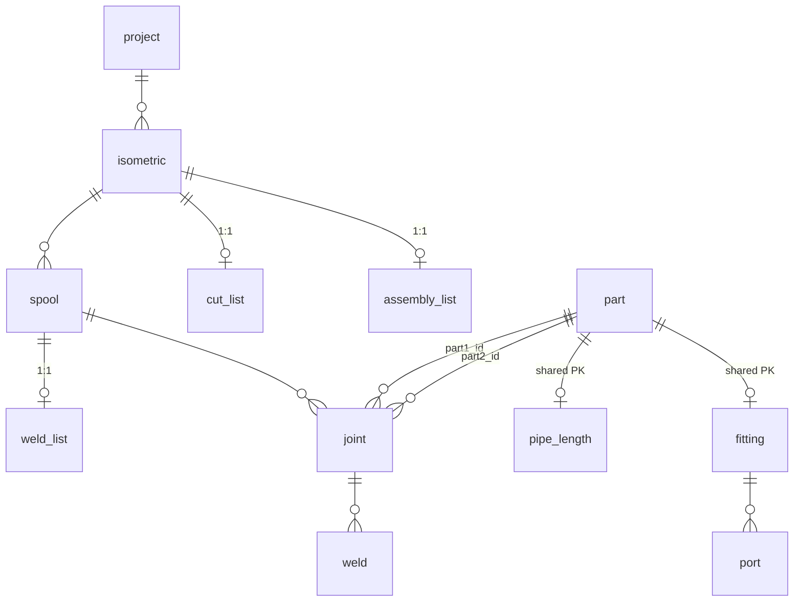

# Base de dados — `db/`

O esquema e seed do CAPO — MariaDB com SQL puro (sem migrations ORM), 23 tabelas organizadas por propósito: autenticação, lookup, hierarquia de desenho, peças com herança joined-table, montagem/solda, eventos de status e ordens de trabalho.

## Visão geral

O CAPO usa **raw SQL** para o schema — o MikroORM não gerencia migrations, seeders ou views (os stubs em `api/src/database/` são vazios). As três query files são montadas no `init` do container MariaDB e aplicadas **apenas na primeira boot de um volume vazio**. O schema é uma fonte de verdade partilhada: quem muda o DB edita o SQL e sincroniza as entidades MikroORM à mão.

Os dados de progresso e gating são **derivados** — as listas (`cut_list`, `assembly_list`, `weld_list`) armazenam apenas `internal_id`, o FK 1:1 para isométrico/spool, e `claimed_by_id`/`claimed_at` para o lock exclusivo. O estado atual de cada item é um ENUM denormalizado; a trilha auditável é uma tabela append-only `<item>_status_event`.

## Estrutura de ficheiros

| Ficheiro             | Papel                                                                                                                    |
| -------------------- | ------------------------------------------------------------------------------------------------------------------------ |
| `01-create.sql`      | Schema completo — 23 `CREATE TABLE`, CONSTRAINTs (CHECK, FK, UNIQUE), 7 índices manuais (FKs auto-indexadas pelo InnoDB) |
| `02-insert.sql`      | Seed — dados iniciais (10 users, 4 roles, 120 parts, 60 joints, 60 welds, …)                                             |
| `99-drop-tables.sql` | Teardown manual — `DROP TABLE` com `FOREIGN_KEY_CHECKS = 0`                                                              |

Reaplicar: `bun run docker:down` (dropa o volume) + `up`, ou `bun run docker:rebuild`.

## Entidades — Campos e papel

### Autenticação e papéis

| Tabela      | Campos principais                                                                                                     | Papel                                                                        |
| ----------- | --------------------------------------------------------------------------------------------------------------------- | ---------------------------------------------------------------------------- |
| `user`      | `id`, `internal_id` (UNIQUE), `password`, `name`, `birth_date`, `gender` (ENUM `'M'`/`'F'`/`'O'`), `photo` (nullable) | Conta do utilizador; `internal_id` é a chave usada em JWT claims             |
| `role`      | `id`, `name` (UNIQUE)                                                                                                 | 4 papéis fixos: `cutting-operator`, `pipe-fitter`, `welder`, `administrator` |
| `user_role` | `user_id`→`user` (CASCADE), `role_id`→`role` (CASCADE), `document`                                                    | Many-to-many; `document` = URL do certificado do utilizador                  |

### Dados de referência (lookup)

| Tabela            | Campos principais                                                  | Papel                                                             |
| ----------------- | ------------------------------------------------------------------ | ----------------------------------------------------------------- |
| `material`        | `id`, `name` (UNIQUE)                                              | Tipo de material (304L, 316L, CS, GAL)                            |
| `diameter`        | `id`, `nominal_mm` (UNIQUE, >0), `nominal_inch` (>0)               | 31 valores de 6mm a 1050mm                                        |
| `fitting_type`    | `id`, `name` (UNIQUE)                                              | 8 tipos: cap, collar, elbow, flange, pipe, reducer, specials, tee |
| `filler_material` | `id`, `name` (UNIQUE)                                              | 5 consumíveis de solda (ER70S-6, E7018-1, ER316L, E6013, ER4043)  |
| `wps`             | `id`, `internal_id` (UNIQUE), `document`, `tpi` (DECIMAL(4,2), >0) | Welding Procedure Specification; `document` = PDF do procedimento |

### Hierarquia de desenho

| Tabela      | Campos principais                                                          | Papel                                  |
| ----------- | -------------------------------------------------------------------------- | -------------------------------------- |
| `project`   | `id`, `internal_id` (UNIQUE), `name`, `client`                             | Projeto industrial                     |
| `isometric` | `id`, `internal_id` (UNIQUE), `project_id`→`project` (CASCADE), `document` | Desenho de tubulação; `document` = PDF |
| `spool`     | `id`, `internal_id` (UNIQUE), `isometric_id`→`isometric` (CASCADE)         | Conjunto de tubos num isométrico       |

### Peças (herança joined-table)

| Tabela        | Campos principais                                                                                                                                      | Papel                                                                                                                       |
| ------------- | ------------------------------------------------------------------------------------------------------------------------------------------------------ | --------------------------------------------------------------------------------------------------------------------------- |
| `part`        | `id`, `type` (ENUM: `pipe_length`/`fitting`), `number`                                                                                                 | **Raiz** — sem FK; discriminador de herança. `number` é o código de desenho (VARCHAR, não único — repete entre isométricos) |
| `pipe_length` | `id`→`part` (CASCADE, **shared PK**), `heat_number` (nullable), `material_id`→`material`, `diameter_id`→`diameter`, `status` (ENUM, default `'to_do'`) | Tubos do estágio de **corte**                                                                                               |
| `fitting`     | `id`→`part` (CASCADE, **shared PK**), `heat_number` (nullable), `material_id`→`material`, `fitting_type_id`→`fitting_type`                             | Acessórios do estágio de **montagem**                                                                                       |
| `port`        | `id`, `number` (INT), `fitting_id`→`fitting` (CASCADE), `diameter_id`→`diameter`                                                                       | Ponto de conexão de um fitting; UNIQUE(fitting_id, number)                                                                  |

### Montagem e solda

| Tabela  | Campos principais                                                                                                                                                            | Papel                                                                                               |
| ------- | ---------------------------------------------------------------------------------------------------------------------------------------------------------------------------- | --------------------------------------------------------------------------------------------------- |
| `joint` | `id`, `part1_id`→`part` (CASCADE), `part2_id`→`part` (CASCADE), `spool_id`→`spool` (CASCADE), `status` (ENUM, default `'to_do'`), CHECK(part1≠part2)                         | Junta entre 2 peças num spool; CHECK impede auto-conexão                                            |
| `weld`  | `id`, `number` (VARCHAR(10)), `joint_id`→`joint` (CASCADE), `filler_material_id`→`filler_material` (SET NULL), `wps_id`→`wps` (SET NULL), `status` (ENUM, default `'to_do'`) | Solda de uma junta; `filler_material_id` e `wps_id` são opcionais (preenchidos no momento da solda) |

### Eventos de status (append-only)

Cada tabela tem: `id` AUTO_INCREMENT, `status` (ENUM), `notes` (TEXT), `created_by_id`→`user` (SET NULL), `created_at`. **Sem `updated_at`** — registos imutáveis.

| Tabela                     | FK do item                               | ENUM                           |
| -------------------------- | ---------------------------------------- | ------------------------------ |
| `pipe_length_status_event` | `pipe_length_id`→`pipe_length` (CASCADE) | `to_do`, `in_progress`, `done` |
| `joint_status_event`       | `joint_id`→`joint` (CASCADE)             | `to_do`, `done`                |
| `weld_status_event`        | `weld_id`→`weld` (CASCADE)               | `to_do`, `done`                |

### Ordens de trabalho (statusless)

| Tabela          | Campos                                       | Claim                                           | Papel                                    |
| --------------- | -------------------------------------------- | ----------------------------------------------- | ---------------------------------------- |
| `cut_list`      | `isometric_id`→`isometric` (CASCADE, UNIQUE) | `claimed_by_id`→`user` (SET NULL), `claimed_at` | 1:1 com isométrico; tracking de corte    |
| `assembly_list` | `isometric_id`→`isometric` (CASCADE, UNIQUE) | `claimed_by_id`→`user` (SET NULL), `claimed_at` | 1:1 com isométrico; tracking de montagem |
| `weld_list`     | `spool_id`→`spool` (CASCADE, UNIQUE)         | `claimed_by_id`→`user` (SET NULL), `claimed_at` | 1:1 com spool; tracking de solda         |

## Hierarquia e herança joined-table

A herança joined-table usa `part` como **raiz sem FK** — `pipe_length.id` e `fitting.id` são FK+PK que apontam para `part.id`. Consequências:

- **IDs não contínuos** em `pipe_length` — gaps entre IDs são ocupados por `fitting` na mesma tabela `part`.
- **Query OR-join** — para encontrar pipe lengths de uma `joint`, faz-se `WHERE part1_id IN (SELECT id FROM pipe_length) OR part2_id IN (SELECT id FROM pipe_length)`.
- **Insert em duas etapas** — primeiro cria-se `part` (gera AUTO_INCREMENT), depois `pipe_length`/`fitting` com o mesmo `id`.
- **`idx_part_type`** é crucial para filtrar o discriminador.

## Relações FK

### Cascata (ON DELETE CASCADE)

A entidade mãe apaga e remove os filhos. Aplica-se a: `user_role`, `isometric`, `spool`, `part→pipe_length/fitting`, `fitting→port`, `joint`, `weld`, status events, e lists.

### Set NULL (ON DELETE SET NULL)

O referenciado é opcional — aplica-se a: `weld.filler_material_id`, `weld.wps_id`, status events `created_by_id`, e lists `claimed_by_id`. Permite que o item sobreviva sem esses dados.

### Sem CASCADE (RESTRICT)

Protege dados de referência — impede apagar `material`, `diameter`, `fitting_type` enquanto houver entidades dependentes.

## Índices

Índices manuais (além dos implícitos de PK/UNIQUE/FK). O InnoDB **auto-indexa toda coluna FK**, então índices de FK não se repetem aqui; só ficam os que uma query realmente usa fora disso:

| Tabela                           | Índice                              | Porquê                                               |
| -------------------------------- | ----------------------------------- | ---------------------------------------------------- |
| `part`                           | `type`                              | discriminador da herança joined-table                |
| `pipe_length` / `joint` / `weld` | `status`                            | baixa cardinalidade; reservado p/ filtros por estado |
| `*_status_event` (×3)            | composite `(<item>_id, created_at)` | `WHERE <item>_id ORDER BY created_at` do histórico   |

## Seed data

| Entidade          | Count | Notas                                                                                   |
| ----------------- | ----- | --------------------------------------------------------------------------------------- |
| `user`            | 10    | 1 admin (todos os papéis), 3 welders, 3 pipe-fitters, 2 cutting-operators, 1 admin-only |
| `role`            | 4     | cutting-operator, pipe-fitter, welder, administrator                                    |
| `material`        | 4     | 304L, 316L, CS, GAL                                                                     |
| `diameter`        | 31    | 6mm a 1050mm                                                                            |
| `fitting_type`    | 8     | cap, collar, elbow, flange, pipe, reducer, specials, tee                                |
| `filler_material` | 5     | ER70S-6, E7018-1, ER316L, E6013, ER4043                                                 |
| `wps`             | 5     | WPS001-WPS005                                                                           |
| `project`         | 1     | PROJETO GENESIS                                                                         |
| `isometric`       | 10    | ISO0001-ISO0010                                                                         |
| `spool`           | 30    | 3 por isométrico                                                                        |
| `part`            | 120   | 70 pipe_lengths + 50 fittings                                                           |
| `port`            | 70    | 1-2 por fitting (sobre os 50 fittings)                                                  |
| `joint`           | 60    | 2 por spool                                                                             |
| `weld`            | 60    | 1 por joint                                                                             |
| `cut_list`        | 10    | 1 por isométrico                                                                        |
| `assembly_list`   | 10    | 1 por isométrico                                                                        |
| `weld_list`       | 30    | 1 por spool                                                                             |

## Padrões comuns

| Padrão                       | Detalhes                                                                                                                                             |
| ---------------------------- | ---------------------------------------------------------------------------------------------------------------------------------------------------- |
| **Timestamps automáticos**   | `created_at` = `DEFAULT CURRENT_TIMESTAMP`, `updated_at` = `DEFAULT CURRENT_TIMESTAMP ON UPDATE CURRENT_TIMESTAMP` — atualizados pelo DB, sem código |
| **IDs duplos**               | Entidades negociáveis têm `id` (INT, PK interna) + `internal_id` (VARCHAR, identificador externo legível). Entidades internas/raiz têm apenas `id`   |
| **Status denormalizado**     | Cada item tem `status` ENUM como estado atual **mais** trilha append-only de status events                                                           |
| **Gating por ENUM**          | `status` é filtrado diretamente nas queries de gating (raw-SQL nos repositórios), sem aplicação de regras em JS                                      |
| **`FOREIGN_KEY_CHECKS = 0`** | No `99-drop-tables.sql` — permite DROP em qualquer ordem, sem depender da ordem de dependência das FKs                                               |
