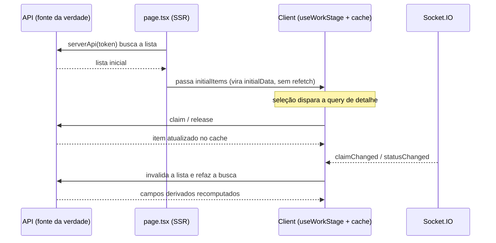
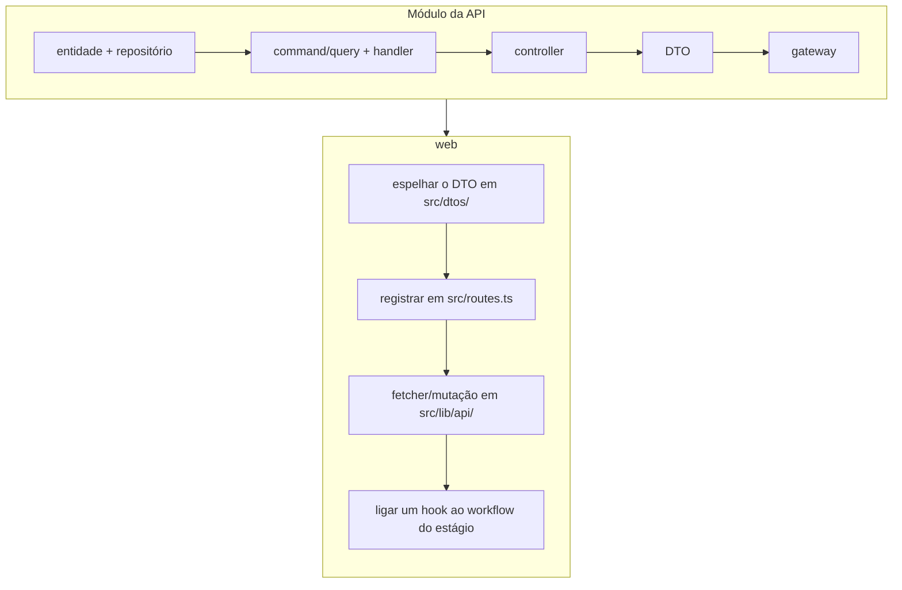

<div align="center">

# Frontend — `@capo/web`

A camada de interface do CAPO — as estações de **corte**, **montagem** e **soldagem** dos operadores de chão de fábrica, com sincronização em tempo real entre elas.

[](https://www.typescriptlang.org/)
[](https://nextjs.org/)
[](https://react.dev/)
[](https://react-bootstrap.netlify.app/)
[](https://tanstack.com/query)
[](https://socket.io/)

</div>

## Visão geral

`@capo/web` é uma aplicação Next.js 16 (App Router) construída sobre React Server Components. Cada estação nasce no servidor — que busca os dados iniciais já com o cookie da sessão e os entrega hidratados ao cliente — e, a partir daí, o TanStack Query cuida do cache enquanto o Socket.IO mantém as estações em sincronia: concluído um estágio, o seguinte abre sozinho, sem recarregar a página. O servidor é a fonte da verdade; o cliente apenas o reflete e envia mutações.

## Stack

| Camada          | Tecnologias                           |
| --------------- | ------------------------------------- |
| **Framework**   | Next.js 16 (App Router), React 19     |
| **Linguagem**   | TypeScript                            |
| **UI**          | React-Bootstrap + SCSS, Framer Motion |
| **Cache/Query** | TanStack Query v5                     |
| **Tempo real**  | Socket.IO client                      |
| **HTTP**        | ky                                    |
| **Ícones**      | Heroicons                             |

## Rotas e autenticação

O middleware (`src/proxy.ts`, nome renomeado do middleware no Next 16) protege as rotas do grupo `(factory)`: lê o cookie `token` e valida a sessão em `GET /auth/me`. Admin acessa tudo; os demais só a sua estação.

| Rota        | Papel exigido      |
| ----------- | ------------------ |
| `/cut`      | `cutting-operator` |
| `/assembly` | `pipe-fitter`      |
| `/weld`     | `welder`           |

Fluxo: login em `/login` → `/` redireciona para `/roles` (painel com um `StationCard` por estação, contagem de pendentes ao vivo) → o operador escolhe a estação.

## Server/Client split

Cada tela de estágio segue o mesmo padrão:

1. **`page.tsx`** — Server Component async. Lê o cookie, repassa o header `Cookie` à API via `serverApi(token)` e busca a lista inicial e o perfil (`getMe`). Passa `initialItems` + `currentUser` ao client.
2. **`*Client.tsx`** — `"use client"`. Consome o hook `use<Stage>Workflow` e renderiza a UI. O TanStack Query assume o cache a partir da `initialData` injetada pelo SSR, sem refetch automático.

O servidor é a fonte da verdade; o cliente reflete o estado e envia mutações.

## Fonte única de URLs — `src/routes.ts`

Toda URL, namespace e nome de evento é centralizado aqui — nada hard-coded inline:

- **`ROUTES`** — URLs de página (`/login`, `/roles`, `/cut`, `/assembly`, `/weld`, `/unauthorized`, …).
- **`API_ROUTES`** — endpoints REST por recurso. Listas (`cutLists`, `assemblyLists`, `weldLists`) expõem `base`, `id`, `claim`, `pendingCount`; itens (`pipeLengths`, `joints`, `welds`) expõem `base`, `id`, `statusEvents`.
- **`WS_ROUTES`** — namespaces Socket.IO (`/cut-list`, `/assembly-list`, `/weld-list`).
- **`WS_EVENTS`** — eventos de conexão (`connect`, `disconnect`, …) e de estágio (`claimChanged`, `statusChanged`).

## Camada de dados (`src/lib/`)

### `api/` — acesso HTTP

Todo HTTP passa por aqui; `client.ts` define três instâncias `ky` e nenhuma chamada `ky` crua vive fora dele:

| Instância          | Uso         | Autenticação                                             |
| ------------------ | ----------- | -------------------------------------------------------- |
| `browserApi`       | Client-side | `credentials: "include"`; mapeia 401 → "sessão expirada" |
| `publicApi`        | Login       | `credentials: "include"`, sem o hook de erro             |
| `serverApi(token)` | SSR / proxy | header `Cookie: token=<token>`                           |

Um módulo por recurso (`auth.ts`, `cut-lists.ts`, `joints.ts`, `welds.ts`, `wps.ts`, …) exporta fetchers e mutações tipados sobre `API_ROUTES`.

### `query/` — TanStack Query

- `keys.ts` — factory de query keys (`queryKeys.cutLists()`, `queryKeys.currentUser()`, `queryKeys.wps()`, …), retornando arrays `as const`.
- `provider.tsx` — `QueryProvider`, montado no layout raiz. Usa um `QueryClient` singleton no browser e um novo a cada request no servidor, para não vazar cache entre requisições no SSR.

### `ws/` — Socket.IO

`socket.ts` (transporte WebSocket apenas, reconexão automática) e `useStageSocket` (ver [Tempo real](#tempo-real)).

## DTOs e interfaces

- **`src/dtos/`** — 20 DTOs que espelham as entidades da API (cut-list, joint, weld, isometric, spool, fitting, part, user, role, status-event, wps, …). São o contrato de tipagem com o backend.
- **`src/interfaces/`** — tipos para dados de detalhe enriquecido: `pipe-length-with-context` e `weld-with-context`.

## Work-Stage Engine (`src/features/work-stage/`)

O cerne do frontend. `useWorkStage<TList>` (`useWorkStage.ts`) é um hook genérico, parametrizado por `WorkStageConfig<TList>` (`types.ts`); os três estágios compartilham a mesma implementação.

```typescript
interface WorkStageConfig<TList extends StageListItem> {
  context: StageContext; // chave de tabSearchFieldMapping
  queryKey: QueryKey; // ["cut-lists"] | ["assembly-lists"] | ["weld-lists"]
  fetchList: () => Promise<TList[]>;
  fetchById: (id: number) => Promise<TList>;
  claim: (id: number) => Promise<TList>;
  release: (id: number) => Promise<TList>;
  ws: { route: string; eventNames: string[] };
}
```

O hook recebe ainda `initialItems` (do SSR) e um `fetchError` opcional, e gerencia:

- **Lista leve** — `useQuery` semeado por `initialData`, com `staleTime: Infinity` e sem refetch em background.
- **Detalhe sob demanda** — query separada (`[...queryKey, "detail", selectedId]`), disparada apenas quando um item é selecionado.
- **Claim / Release** — mutações. `claim` semeia o cache de detalhe e seleciona o item; `release` atualiza o cache (`replaceById`) e desseleciona. Ambas invalidam a lista.
- **Sincronização** — `useStageSocket` invalida lista e detalhe nos eventos do gateway.
- **Estado de UI** — abas (`all` / `working`), busca e campo de busca (auto-sincronizado por aba).

O retorno expõe: dados (`items`, `selectedDetail`, `selectedId`/`setSelectedId`), estado de UI (`activeTab`, `search`, `searchField` e seus setters), erro (`errorMsg`/`setErrorMsg`), ações (`claim`, `release`, `isClaiming`, `isReleasing`) e o `queryClient`.

### Fluxo de dados



## Composição de hooks

Cada estágio tem um hook top-level `use<Stage>Workflow` que compõe o engine base com a lógica específica. Os itens "em trabalho" derivam de `selectedDetail` (a árvore completa da ordem aberta), não da lista leve. Um `index.ts` por estágio re-exporta os hooks.

### Por estágio (`src/app/(factory)/*/hooks/`)

| Hook                      | Responsabilidade                                       |
| ------------------------- | ------------------------------------------------------ |
| `use<Stage>ListTable`     | Seleção, estados de linha, busca e navegação na lista  |
| `use<Item>Table` / `Grid` | Itens em trabalho (pipe lengths, joints ou welds)      |
| `use<Stage>Operations`    | Mutações de status event (iniciar / concluir trabalho) |
| `use<Stage>EventHandlers` | Handlers dos eventos da UI                             |
| `use<Stage>Workflow`      | Workflow top-level: compõe o engine + os hooks acima   |

### Compartilhados (`src/hooks/`)

| Hook                      | Responsabilidade                                                                               |
| ------------------------- | ---------------------------------------------------------------------------------------------- |
| `useWorkTableBase`        | Seleção, destaque e busca; delega ordenação "concluídos por último"                            |
| `useWorkStatusAccessor`   | Mapeia status do DB → estado de UI (`to-do`/`information`/`working`/`finished`) e detecta lock |
| `useTableUtils`           | `sortFinishedLast`, `filterBySearch` (puras) + `useRowStates`                                  |
| `useFinishedItemsSorting` | Deriva os IDs concluídos para reordenação                                                      |
| `useModalState<T>`        | Estado genérico de modal                                                                       |
| `useUIConfigurations`     | Factory de cards, botões e dados de modal a partir do item selecionado                         |
| `useInformationState`     | Toggle do destaque "information"                                                               |

Os quatro estados de UI (`to-do`/`information`/`working`/`finished`) que o `useWorkStatusAccessor` aplica vêm de `WORK_STATES` (`src/constants`).

## Tempo real

Conexão Socket.IO por namespace — `/cut-list`, `/assembly-list`, `/weld-list`.

`useStageSocket` assina os `eventNames` do estágio (`claimChanged`, `statusChanged`) e, a cada evento:

1. invalida a query da lista — o servidor recomputa os campos derivados no refetch;
2. dispara um callback `onEvent` que invalida o cache de detalhe.

Refs internas guardam `queryKey`, `eventNames` e `onEvent` para evitar closures defasadas nos callbacks do socket.

## Loading e erros

- **`isClaiming` / `isReleasing`** — estados pendentes das mutações; desabilitam os botões durante claim/release.
- **`errorMsg` / `setErrorMsg`** — erro no engine, alimentado pelo `fetchError` inicial (SSR) ou por falha de mutação.
- **`ErrorToast`** (`src/components/common/`) — toast `bg="danger"`, autohide 5s, bottom-center, renderizado no layout do estágio.

## Componentes

### `src/components/features/`

| Componente     | Responsabilidade                                                          |
| -------------- | ------------------------------------------------------------------------- |
| `WorkTable`    | Tabela ordenável com animações Framer Motion; cor da linha por estado     |
| `WorkGrid`     | Grid de cards agrupados por spool (joints / welds)                        |
| `WorkPanel`    | Painel de detalhes; valores via union discriminada (Normal/Tagged/Double) |
| `WorkTabs`     | Toggle `all` / `working` (genérico)                                       |
| `ControlPanel` | Busca com dropdown de campo + botões de ação                              |
| `PDFViewer`    | Exibição inline de PDF (desenho isométrico)                               |

### `src/components/layout/`

| Componente | Responsabilidade                                                                                           |
| ---------- | ---------------------------------------------------------------------------------------------------------- |
| `NavBar`   | Barra fixa superior: logo, título, logout                                                                  |
| `Modals`   | `BaseModal`, `ConfirmModal`, `InputModal`, `FormModal`, `ComponentLabelModal`, `MaterialVerificationModal` |

## Variações por estágio

Cada estágio também tem um `utils/*Utils.ts` com funções de extração de dados (ex. `extractWeldsFromAssemblyList`).

### Cut

- Duas tabelas: a lista de cut-lists e os pipe lengths em trabalho.
- Captura o `heat_number` (`InputModal`) e o label do componente (`ComponentLabelModal`).
- Painel de detalhes: comprimento, diâmetro, heat number, isométrico, material, espessura.

### Assembly

- `WorkTable` (lista) + `WorkGrid` (joints agrupados por spool).
- `PDFViewer` inline com o desenho isométrico, no lugar do painel de detalhes.
- Verificação de material multi-step (`MaterialVerificationModal`).

### Weld

- `WorkTable` (lista) + `WorkGrid` (welds agrupados por spool).
- `FormModal` para os dados da solda (filler material, WPS).
- Verificação de dados com download do documento WPS.
- Painel de detalhes: spool, TPI, WPS, filler material.

## Adicionar uma feature



## Comandos

```bash
bun run dev    # next dev
bun run lint   # eslint
bun run build  # next build (standalone output)
```

Path aliases (tsconfig `paths`): `@/*`, `@components/*`, `@dtos`/`@dtos/*`, `@interfaces`/`@interfaces/*`, `@styles/*`, `@hooks`, `@constants`.
